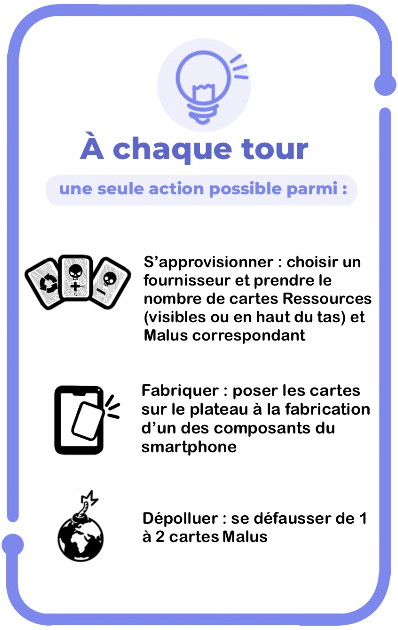

## Informations générales

Ce jeu sérieux a été conçu et réalisé par le service Inria Learning Lab.  
Pour nous contacter: phoneimpact@inria.fr.

!!! info "En bref"
    - **But du jeu :** Sensibiliser à l'impact environnemental des composants d'un smartphone
    - **joueur·euses :** 3 à 5
    - **Âge :** Dès 14 ans
    - **Durée :** 40 min
**Expérience de jeu :**

Émotions : l’apprenant sera amené à être étonné/surpris, voire scandalisé

Se mettre à la place d'un fabricant de smartphones, tiraillé par l'envie de dégager du profit tout en polluant le moins possible (green washing ! ou véritable conscience écologique)

{ width="300" }

## Instructions pour l'animateur (matériel, règles, brief/debrief...)

[Instructions pour animer le jeu](../Animation/Preparation)

## License
Le jeu PhoneImpact est sous license [CC BY-NC-SA 4.0](https://creativecommons.org/licenses/by-nc-sa/4.0/deed.fr) : Attribution - Pas d’Utilisation Commerciale - Partage dans les Mêmes Conditions 4.0 International

## Print and play

[Imprimer les cartes et le plateau](../PrintAndPlay/index)

## Sources
Un feuillet présent dans la boite de jeu permet de retrouver toutes les sources du jeux ([lien](../Ressources/Sources_malus.md))

## Materiel

### 138 Cartes *Ressources*
Il existe 3 types de ressources qui correspondent à 3 tas de cartes :

| Type de resssources| PolluPlus | PolluMoins | Recyclage | Total |
| -------- |-----------|------------|-----------|-----------|
| Métaux communs | 20        | 10         | 6         |36|
| Métaux rares | 20        | 10         | 0         |30|
| Terres rares | 8         | 4          | 0         |12|
| Métaux précieux | 6         | 4          | 2         |12|
| Autres Matières | 27        | 14         | 7         |48|
| **Somme** | 81        | 42         | 15        |138|

**Précision importante** : le pourcentage de cartes nécessaires pour les composants n'est pas représentatif du poids réel des ressources d'un smartphone ni de la quantité de matière mais permet de symboliser la variété des ressources nécessaires.

### Présentation du jeu
Dans ce jeu, vous incarnez un fabricant de smartphones et votre objectif
est de construire un smartphone tout en minimisant votre impact
environnemental. Vous aurez des choix à faire tout au long du jeu mais
attention, ces choix auront des conséquences.

Vous avez chacun un plateau smartphone composé de : l'écran tactile
(dalle et vitre), la batterie, la coque (et ses connectiques), la carte mère.
**Par soucis de simplification, la carte mère désigne l'ensemble des composants électroniques associés : processeur, mémoire vive, disque dur, haut-parleur, microphone, caméras, antenne...**

Chaque composant est constitué de ressources qui apparaissent sur le
plateau. Ces ressources sont désignées par des types de ressources qui sont les
suivants dans le jeu :

-   **Métal précieux** mais aussi rare, stratégique donc cher comme l'Or, l'argent, le platine, le palladium...
    -> *représenté par un lingot d'Or*

-   **Métal rare** Non précieux mais peu fréquent dans le sol comme le Lithium, le tantale, l'indium...
    -> *représenté par une pierre précieuse bleu*

-   **Métal commun** L'extraction nécessite beaucoup de ressources et d'énergie comme l'Aluminium, le cuivre, le nickel...
    -> *représenté par un métal gris*

-   **Terre rare** (Pas si rare mais difficile à extraire) comme l'Yttrium, le néodyme, la gadolinium...
    -> *représenté par un tas de terre marron*

-   **Autre matière** (40 à 70% du poids du smartphone) comme le plastique, le verre, la céramique, les matières synthétiques...
    -> *représenté par une fibre violette*

Le but du jeu est de rassembler assez de ressources pour construire tous les composants de votre smartphone.

Cependant, l'acquisition des ressources peut s'accompagner de malus qui auront des conséquences dans la suite du jeu.
Les textes des cartes malus sont lues quand elles sont tirées.

[Detail du matériel si besoin](Materiel.md)

En cas d'oubli, vous pouvez vous référer à l'aide de jeu :

{ width="300" }

### Qui commence à faire l'action désignée par la carte événement
- Certains événements désignés par le signe '*' nécessitent de départager les joueur·euses pour savoir qui commence.
- Dans ce cas, on privilégie celui qui a le plus de cartes Recyclage, puis le moins de cartes malus.

## Adaptation des règles pour une partie en 20'
- On ne garde que les événements : 1 ; 2 ; 6 ; 7 ; 10 ; 13 ;