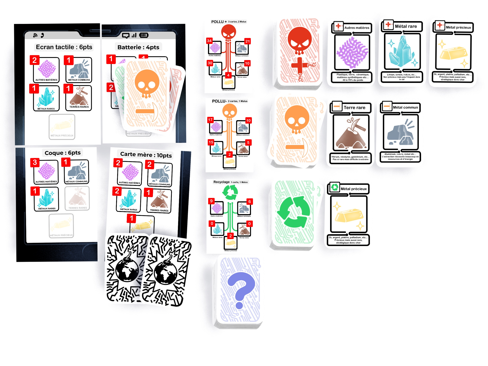

# Préparation du jeu

## Plateau de jeu à construire
Chaque joueur possède un smartphone à construire en assemblant les 4 composants : Coque, Carte Mère, Batterie, Ecran Tactile.
Mélanger les cartes malus et les placer au milieu.

## 3 pioches de cartes ressources
Selon le nombre de joueurs,

Les cartes ressources doivent être bien mélangées puis rassemblées en pioche, chacune représentant des ressources vendues par un fournisseur:

- PolluPlus qui fait du minage classique polluant non responsable
    - 3 cartes ressources sont tirées de la pioche et placées côté
    - 2 malus

- PolluMoins qui fait du minage avec des efforts
    - 2 cartes ressources visibles parmi tous les types
    - 1 malus

- Recyclage
    - 1 carte ressource visible parmi les métaux recyclables
    - Pas de malus
    - Ne contient pas de terres rares, ni de métaux rares

### Cartes malus

Les cartes malus sont mélangées et déposées en un tas, face cachée.
- 50 cartes malus
- 1 carte "Attention, vous commencez à trop polluer" à placer en position (nombre de joueurs x 3)
- 1 carte "Alerte pollution, vos malus sont déduis de votre total de points" à placer en position (nombre de joueur x 5)

Exemple : à 5 joueurs la carte "attention" se place en 15e position de la pioche malus et la carte "alerte" se place en 25e position de la pioche malus.

### Cartes événements

15 cartes événements dont l'ordre est défini par un numéro sur celle-ci. Ces cartes événements déclencheront des actions particulières à chaque tour de jeu.

Certains événements désignent le joueur qui a le moins de malus (ex: action xxx commençant par celui qui a le moins de malus).
- En cas d'égalité sur le nombre de malus, on regarde celui qui a le plus de cartes recyclés.
- En cas d'égalité, on prend celui qui a le smartphone ayant l'indice de réparabilité le plus haut
- En cas d'égalité, on prend celui qui a le smartphone ayant le smartphone le plus vieux

Selon le nombre de joueurs, on enlève certaines cartes :
- on enlève les 2 dernières cartes (#13 et #14) à 5 joueurs
- on enlève la dernière carte (#14) à 4 joueurs
